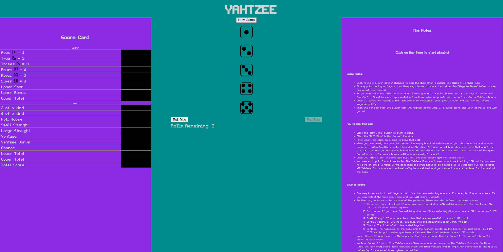

# Lets Play YAHTZEE!

[Play Yahtzee here](https://sscottk.github.io/game-of-yahtzee/)

## About this app
I enjoyed playing Yahtzee as a kid and thought it would be fun to make as a browser game. This is the first browser game I have ever made. In the game you can roll dice and score them base on the given scoring methods. You will have to pay attention though as you can only score in each space once. I hope you enjoy playing as much as I do!!

## Rules

### Just some basics
- Each round a player gets 3 chances to roll the dice. When a player is rolling it is their turn
- At any point during a players turn they may choose to score their dice. See **"Ways to Score"** below to see how points are scored.
- If you can not score with the dice after 3 rolls you will have to choose one of the ways to score and "scratch" it. Scratches are represented with a 0 and give no points. You can not scratch a Yahtzee bonus.
- Once all boxes are filled, either with points or scratches, your game is over and you can not score anymore points.
- When the game is over the player with the highest score wins. If playing alone and your score is ove 150 you win.

## Ways to score

- One way to score is to add together all dice that are matching numbers. For example if you have four 2's you will score 8 points.
- Another way to score is to use one of the patterns. There are six different patterns to score with.
    - Three and Four of a kind. If you have any 3 or 4 dice with matching numbers, the points are the total of all dice added together.
    - Full House. If you have two matching dice and three matching dice you have a FUll house worth 25 points.
    - Small Straight. If you have four dice that are sequential it is worth 30 point.
    - Large Straight. If you hace five dice that are sequential it is worth 40 point.
    - Chance. The total of all dice added togethe.
    - Yahtzee. The namesake of the game and the highest points on the board. You must have ALL FIVE DICE matching in number you have a Yahtzee! The first Yahtzee is worth 50 points.
- Upper Bonus. If your score in the upper section is ever more than or equalt to 63 you get 35 points added to your score.
- Yahtzee Bonus. If you roll a Yahtzee more than once you can score on the Yahtzee Bonus up to three times. You can only score these bonuses after the first Yahtzee and if any other score box is empty (0 is not empty, 0 is a scratch and gives no points)

## Technologies Used

- HTML
- CSS
- JS

## Attributions

If I needed something that wasn't in my notes I searched through MDN.
https://developer.mozilla.org/en-US/docs/Web/JavaScript/Reference/Global_Objects/Array/sort

Font was a 2 stage process:
Found and downloaded .ttf file from:
https://www.1001fonts.com/exepixelperfect-font.html?page=5

converted to a format I could use here:
https://transfonter.org/

Found the converter info here:
https://stackoverflow.com/questions/24990554/how-to-include-a-font-ttf-using-css

Custom made Dice face images by me using Aseprite (I used the steamed version):
https://aseprite.org/

## Future plans

- Add multiplayer
- Add Pixle Art style theme
- Add animations and custom dice images
- ✔ Add custom fonts to match styling (added 6/16/2024)
    

